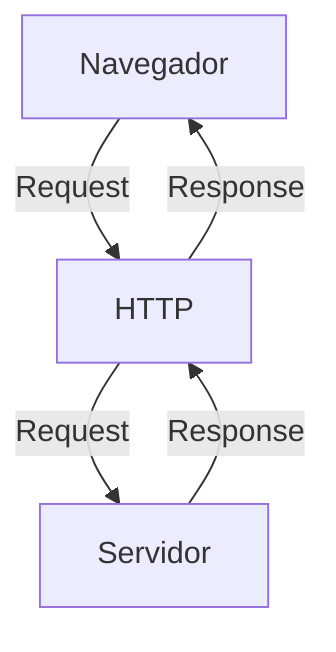

# Curso BackEnd -  1º Semestre - 105h

Prof. Diogo Barbosa

Escola SENAI Americana 

2º Semestre 2026

## Objetivos do Curso

- Desenvolver Aplicações web Server Side, utilizando a linguagem PHP;
- Aplicar Sintaxe nativa Php Vanilla;
- Manipulação HTTP;
- Persistência de Dados(Armazenamento em BD);
- Segurança contra SQL Injection/CSRF;
- Refatoração em POO (Programação Orientada Objeto);
- Arquitetura MVC;
- Utilização do FrameWork Laravel;

## Cronograma do Semestre

Carga Horária: 105h

Duração: 20 Semanas

### Semana 1: Introdução ao BackEnd e Configuração do Ambiente PHP

#### O que é BackEnd

O BackEnd é a parte de um site ou aplicativo que o usuário não vê, mas que faz tudo funcionar por trás das telas.

- Guarda e organiza informações em um banco de dados;
- Confere se o login e a senha estão corretos;
- Calcula valores, como o frete ou o total de uma compra;
- Garante que os dados de um usuário não apareçam para outro;
- Faz o sistema suportar muitas pessoas usando ao mesmo tempo, sem travar.

As principais linguagens utilizadas no desenvolvimento back-end são PHP, JavaScript/TypeScript, Python, Java, Kotlin, Go (Golang), C# e Rust. 

O backend é o "cérebro" oculto de um site ou aplicativo. Ele roda em um servidor e cuida de tudo o que o usuário não vê na tela.

**As 3 partes básicas de todo backend:**

1. **Servidor:** o "computador" que fica ligado esperando pedidos (requisições);
2. **Banco de dados:**  onde as informações ficam guardadas (usuários, produtos, mensagens, etc.);
3. **Lógica de negócio:**  as regras do sistema (ex: "não deixa comprar se não tiver estoque").

**O Mercado de Trabalho em Back-end**

O desenvolvimento Back-end é uma das áreas mais cruciais da Tecnologia da Informação. 

- Com a transformação digital acelerada, empresas de todos os portes e setores dependem de infraestruturas sólidas e seguras. 

- Setores de Atuação: Bancos, hospitais, e-commerces, logística, indústrias, startups e órgãos públicos utilizam BackEnd para suportar suas operações críticas.

- Fatores de Crescimento: O avanço da computação em nuvem, aplicativos móveis, Big Data e IA impulsiona continuamente a busca por profissionais da área.

- Modelos de Trabalho: Alta flexibilidade com vagas presenciais, híbridas e remotas (inclusive com oportunidades
internacionais).

#### Ciclo de Vida da Requsição HTTP

##### O que é HTTP

**HTTP** (Hypertext Transfer Protocol) é um protocolo de comunicação utilizado para transferência de informações na WWW(Word Wide Web) e em outros sistemas de Redes

O HTTP é a base para que o cliente e um servidor web troquem informações. Ele permite a requsição e as respostas de recurso , como imagens, arquivos e as próprias páginas web, por meio de mensagens padrão (protocolo).

##### Como funciona HTTP

1. O cliente estabelece contato com servidor, encaminhando uma requisição HTTP;
2. Nessa Requisição o cliente especifica o método pretendido(read-GET, creat-POST, update-PUT/PATCH, delete-DELETE)
3. O servidor processa e responde com uma mensagem HTTP, com os recursos solicitados.

### Como Funciona na Prática o BackEnd

- **Ação do Usuário**************: Envia uma Solicitação pela UI(Interface do Usuário).
Exemplo de UI: Tela do Celular, Navegador da internet, Alexa ...
- **Envio da Requisição**: A UI transforma a ação do usuário em uma Requisição HTTP;
- **O Processamento BackEnd**: o Código BackEnd recebe o pedido, valida os dados e decide o que fazer (Ex: consulta uma informação no banco de dados).
- **Resposta**: O servidor devolve o resultado para a UI (Ex. Um Login Autorizado, Uma Compra Confirmada)

#### Tipos de requisição HTTP

Os tipos de requisição HTTP indicam a ação que o usuário deseja executar no servidor. As principais ações são:

- **GET**: Pede dados de um lugar especifico. "Não Faz Alterações no Servidor"
- **POST**: Envia dados novos para *criar* algo ou processar informações.
- **POST/PATCH**: Modifica dados já existentes. PUT Atuização total dos dados.*PATCH* Atualizção Parcial dos dados.
- **DELETE**: Apaga um dado do Servidor.

---

##### Iniciando o PHP 

##### O que é PHP

**PHP** (Hypertxt PreProcessor) é uma linguagem de programação interpretada e open source, focada no desenvolvimento de sistemas para web, pode ser usada junto com HTML para criação de páginas web dinâmicas.

##### Instalando o PHP

- Fazer o Download do PHP (php.net);
- ZIP - Non Thread Safe 8.5
- Descompactar o Arquivo do PHP na pasta C:\src\php (Para Descompactar, usar o 7Zip = Melhor) --> Nunca salvar arquivos na raiz do sistema (C:)
- Modificar o arquivo php.ini-development para --> php.ini(criar as configurações do PHP na Máquina) - adicionar ou remover funcionalidade do PHP
- Adicionar a Pasta do PHP(C:\src\php) as Variáveis de Ambiente do Sistema (PATH)
- Verificar a instalação rodando o Comando php --version

#### Contextualização o PHP 

O PHP de fato é uma das linguagens de programação mais populares da atualidade. Ela permite que você crie aplicações web robusta, de uma maneira muito simplificada e direto ao ponto.
Sem contar que a linguagem traz diversos recursos que facilitam e aceleram o processo de desenvolvimento de sites e sistemas para web. E além do mais, ela ainda tem um ótimo ecossistema, uma execelente comunidade e um grande mercado de trabalho.

#### Criando minha primeira aplicação em PHP 

Criando um Hello, Word!!!

##### Criando o Perfil de PHPVanilla

-> Profile -> New Profile
-> Extensions:
- PHP IntePhense ( A do Elefantinho ): AutoCompletar (Snipets)
- PHP Debug (Xdebug): Acha erros em Linha de Código
- PHP CS FIXER: Formatação padrão do Código (Identação)
- PHP Server: Sobre um Servidor Local para Acompanhamento em Tempo Real